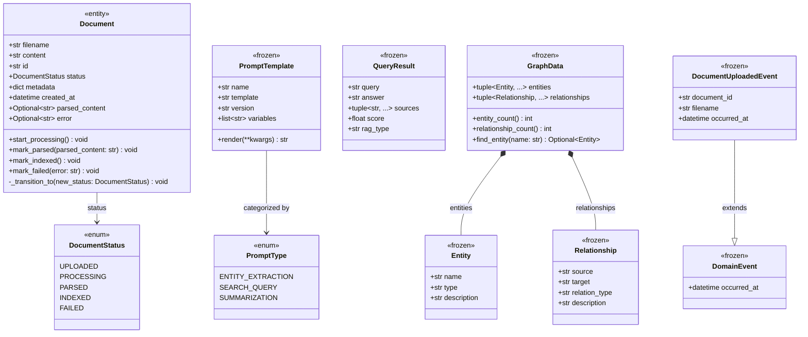
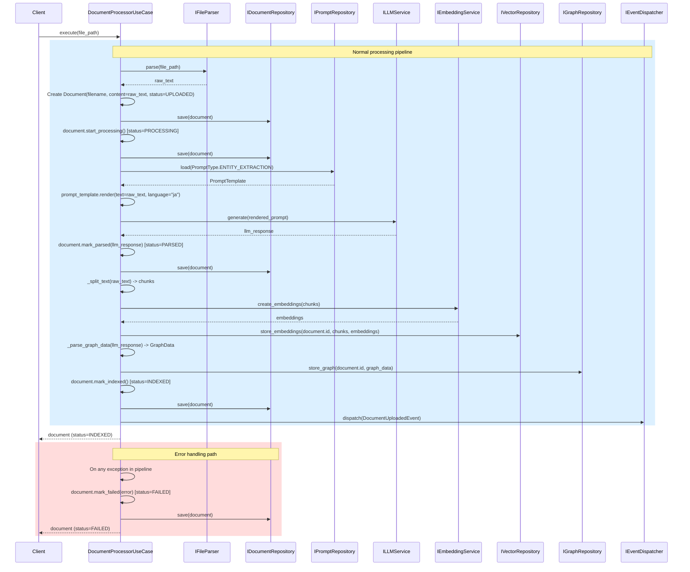

# Phase 2: アーキテクチャ図

## 1. ドメインモデル クラス図

```mermaid
classDiagram
    class DocumentStatus {
        <<enum>>
        UPLOADED
        PROCESSING
        PARSED
        INDEXED
        FAILED
    }

    class PromptType {
        <<enum>>
        ENTITY_EXTRACTION
        SEARCH_QUERY
        SUMMARIZATION
    }

    class Document {
        <<entity>>
        +str filename
        +str content
        +str id
        +DocumentStatus status
        +dict metadata
        +datetime created_at
        +Optional~str~ parsed_content
        +Optional~str~ error
        +start_processing() void
        +mark_parsed(parsed_content: str) void
        +mark_indexed() void
        +mark_failed(error: str) void
        -_transition_to(new_status: DocumentStatus) void
    }

    class PromptTemplate {
        <<frozen>>
        +str name
        +str template
        +str version
        +list~str~ variables
        +render(**kwargs) str
    }

    class QueryResult {
        <<frozen>>
        +str query
        +str answer
        +tuple~str, ...~ sources
        +float score
        +str rag_type
    }

    class Entity {
        <<frozen>>
        +str name
        +str type
        +str description
    }

    class Relationship {
        <<frozen>>
        +str source
        +str target
        +str relation_type
        +str description
    }

    class GraphData {
        <<frozen>>
        +tuple~Entity, ...~ entities
        +tuple~Relationship, ...~ relationships
        +entity_count() int
        +relationship_count() int
        +find_entity(name: str) Optional~Entity~
    }

    class DomainEvent {
        <<frozen>>
        +datetime occurred_at
    }

    class DocumentUploadedEvent {
        <<frozen>>
        +str document_id
        +str filename
        +datetime occurred_at
    }

    Document --> DocumentStatus : status
    PromptTemplate --> PromptType : categorized by
    GraphData *-- Entity : entities
    GraphData *-- Relationship : relationships
    DocumentUploadedEvent --|> DomainEvent : extends
```

## 2. アプリケーション層 依存関係図

```mermaid
classDiagram
    class IDocumentRepository {
        <<interface>>
        +save(document: Document)* void
        +find_by_id(document_id: str)* Optional~Document~
        +find_all()* list~Document~
    }

    class IVectorRepository {
        <<interface>>
        +store_embeddings(document_id: str, chunks: list, embeddings: list)* void
        +search(query_embedding: list, top_k: int)* list~QueryResult~
    }

    class IGraphRepository {
        <<interface>>
        +store_graph(document_id: str, graph_data: GraphData)* void
        +search(query: str)* list~QueryResult~
        +get_graph_data(document_id: str)* Optional~GraphData~
    }

    class IPromptRepository {
        <<interface>>
        +load(prompt_type: PromptType)* PromptTemplate
    }

    class IEventDispatcher {
        <<interface>>
        +dispatch(event: DomainEvent)* void
        +register(event_type: Type, handler: Callable)* void
    }

    class ILLMService {
        <<interface>>
        +generate(prompt: str)* str
    }

    class IEmbeddingService {
        <<interface>>
        +create_embeddings(texts: list~str~)* list~list~float~~
    }

    class IFileParser {
        <<interface>>
        +parse(file_path: str)* str
    }

    class EventDispatcher {
        -dict _handlers
        +register(event_type: Type, handler: Callable) void
        +dispatch(event: DomainEvent) void
    }

    class ComparisonResult {
        <<frozen>>
        +str query
        +list~QueryResult~ vector_results
        +list~QueryResult~ graph_results
        +Optional~str~ vector_error
        +Optional~str~ graph_error
    }

    class DocumentProcessorUseCase {
        -IDocumentRepository _document_repo
        -IPromptRepository _prompt_repo
        -IVectorRepository _vector_repo
        -IGraphRepository _graph_repo
        -IEventDispatcher _event_dispatcher
        -ILLMService _llm_service
        -IEmbeddingService _embedding_service
        -IFileParser _file_parser
        +execute(file_path: str) Document
        -_split_text(text: str, chunk_size: int) list~str~
        -_parse_graph_data(llm_response: str) GraphData
    }

    class CompareRAGUseCase {
        -IVectorRepository _vector_repo
        -IGraphRepository _graph_repo
        -ILLMService _llm_service
        -IEmbeddingService _embedding_service
        +execute(query: str, top_k: int) ComparisonResult
    }

    EventDispatcher ..|> IEventDispatcher : implements

    DocumentProcessorUseCase ..> IDocumentRepository : depends on
    DocumentProcessorUseCase ..> IPromptRepository : depends on
    DocumentProcessorUseCase ..> IVectorRepository : depends on
    DocumentProcessorUseCase ..> IGraphRepository : depends on
    DocumentProcessorUseCase ..> IEventDispatcher : depends on
    DocumentProcessorUseCase ..> ILLMService : depends on
    DocumentProcessorUseCase ..> IEmbeddingService : depends on
    DocumentProcessorUseCase ..> IFileParser : depends on

    CompareRAGUseCase ..> IVectorRepository : depends on
    CompareRAGUseCase ..> IGraphRepository : depends on
    CompareRAGUseCase ..> ILLMService : depends on
    CompareRAGUseCase ..> IEmbeddingService : depends on
    CompareRAGUseCase ..> ComparisonResult : returns
```

## 3. DocumentProcessorUseCase シーケンス図

```mermaid
sequenceDiagram
    participant Client
    participant UseCase as DocumentProcessorUseCase
    participant FileParser as IFileParser
    participant DocumentRepo as IDocumentRepository
    participant PromptRepo as IPromptRepository
    participant LLMService as ILLMService
    participant EmbeddingService as IEmbeddingService
    participant VectorRepo as IVectorRepository
    participant GraphRepo as IGraphRepository
    participant EventDispatcher as IEventDispatcher

    Client->>UseCase: execute(file_path)

    rect rgb(220, 240, 255)
        Note over UseCase, EventDispatcher: Normal processing pipeline

        UseCase->>FileParser: parse(file_path)
        FileParser-->>UseCase: raw_text

        UseCase->>UseCase: Create Document(filename, content=raw_text, status=UPLOADED)
        UseCase->>DocumentRepo: save(document)

        UseCase->>UseCase: document.start_processing() [status=PROCESSING]
        UseCase->>DocumentRepo: save(document)

        UseCase->>PromptRepo: load(PromptType.ENTITY_EXTRACTION)
        PromptRepo-->>UseCase: PromptTemplate

        UseCase->>UseCase: prompt_template.render(text=raw_text, language="ja")

        UseCase->>LLMService: generate(rendered_prompt)
        LLMService-->>UseCase: llm_response

        UseCase->>UseCase: document.mark_parsed(llm_response) [status=PARSED]
        UseCase->>DocumentRepo: save(document)

        UseCase->>UseCase: _split_text(raw_text) -> chunks
        UseCase->>EmbeddingService: create_embeddings(chunks)
        EmbeddingService-->>UseCase: embeddings

        UseCase->>VectorRepo: store_embeddings(document.id, chunks, embeddings)

        UseCase->>UseCase: _parse_graph_data(llm_response) -> GraphData
        UseCase->>GraphRepo: store_graph(document.id, graph_data)

        UseCase->>UseCase: document.mark_indexed() [status=INDEXED]
        UseCase->>DocumentRepo: save(document)

        UseCase->>EventDispatcher: dispatch(DocumentUploadedEvent)
    end

    UseCase-->>Client: document (status=INDEXED)

    rect rgb(255, 220, 220)
        Note over UseCase, DocumentRepo: Error handling path

        UseCase->>UseCase: On any exception in pipeline
        UseCase->>UseCase: document.mark_failed(error) [status=FAILED]
        UseCase->>DocumentRepo: save(document)
        UseCase-->>Client: document (status=FAILED)
    end
```
