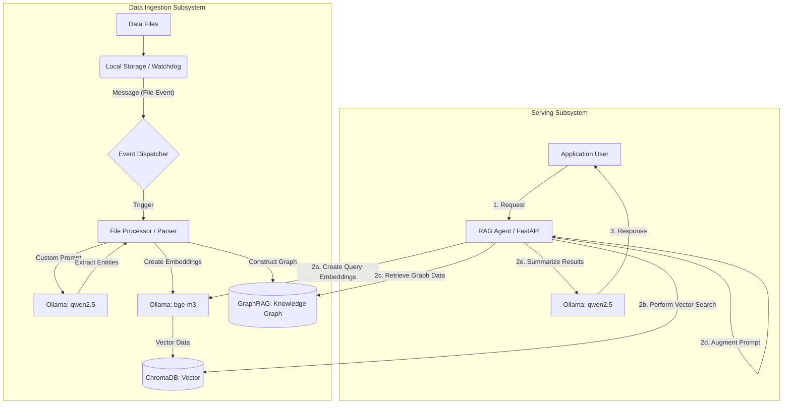

# Local RAG Comparator (GraphRAG vs Vector RAG) - TDD & Docker Edition

## 1. プロジェクトの目的

完全ローカル環境（Mac M4 24GB）において、「通常のVector RAG」と「Microsoft GraphRAG」の検索精度・取得アプローチを比較検証するWebアプリケーションを構築する。
t-wada氏の提唱するTDD（テスト駆動開発：Red-Green-Refactor）を実践し、クリーンアーキテクチャ（DDD準拠）とDockerを採用。堅牢かつ変更に強いモダンなAIアプリケーションのベストプラクティスとして、Zenn/Qiitaでの技術記事化を目指す。

## 2. システムアーキテクチャ (Docker + Native Mac + TDD)

- **開発者体験 (DX) の統合**:
  - `Makefile` を起点とし、`make setup` でAIモデルのPullからコンテナビルドまで一括完了。
  - `make up` 実行時にMacホスト上のOllamaの生存確認と自動バックグラウンド起動を行う。
- **Host (Mac Native - GPU活用)**:
  - Ollama (LLM: qwen2.5:14b / Embedding: bge-m3)
- **Docker Compose Network**:
  - **backend**: FastAPI, GraphRAG CLI連携, PyMuPDF (Python 3.11)
  - **frontend**: React + Vite + react-force-graph (Node.js)
  - **vectordb**: ChromaDB Server
- **コア処理 (GraphRAG)**:
  - Microsoft公式 graphrag パッケージ (Python)
  - 公式リポジトリ: [microsoft/graphrag](https://github.com/microsoft/graphrag)
- **Testing Frameworks**:
  - Backend: pytest, pytest-mock, pytest-asyncio
  - Frontend: Vitest, React Testing Library, MSW (APIモック)
- **Infrastructure Strategy**:
  - **Prompt Management**: プロンプトをハードコードせず、外部定義ファイルまたは環境変数から注入可能にし、パース時や検索時の振る舞いを柔軟に変更可能とする。
  - **Cloud Ready Design**: 実運用を想定し、ファイルシステムを抽象化。ローカルストレージだけでなく、S3/GCS等のオブジェクトストレージへのファイル配置をトリガーとしたイベント駆動型処理への移行を考慮した設計とする。



## 3. ディレクトリ構成

```txt
/ (root)
 ├── Makefile                     # 開発環境のセットアップ・起動・テスト用コマンド集
 ├── docker-compose.yml           # BE, FE, VectorDB のコンテナ定義
 ├── backend/
 │    ├── Dockerfile
 │    ├── requirements.txt
 │    ├── src/
 │    │    ├── domain/            # Entities, Interfaces
 │    │    ├── application/       # UseCases
 │    │    ├── infrastructure/    # ChromaDB, GraphRAG, PyMuPDF
 │    │    ├── interfaces/        # FastAPI Routers
 │    │    ├── core/              # Prompts (YAML/JSON), DI, Settings
 │    │    └── main.py
 │    └── tests/                  # pytest (TDDの主戦場)
 │         ├── unit/              # Domain, Application層の高速テスト
 │         └── integration/       # Infrastructure, Interfaces層の結合テスト
 └── frontend/
      ├── Dockerfile
      ├── package.json
      ├── src/
      └── tests/                  # Vitest (コンポーネントテスト)
```

## 4. 実装フェーズ (TDDサイクル: Red -> Green -> Refactor)

### Phase 1: 開発基盤の構築とセットアップ自動化

- [x] バックエンドディレクトリの作成 (`backend/`) と `Dockerfile`, `requirements.txt` の配置
- [x] フロントエンドのVite初期化 (`npm create vite@latest frontend -- --template react-ts`) と `Dockerfile` の配置
- [x] ルートディレクトリに `docker-compose.yml` を作成
- [x] ルートディレクトリに `Makefile` を作成 (`setup`, `check-ollama`, `up`, `down`, `test-backend` コマンドを定義)
- [x] ターミナルで `make setup` を実行し、OllamaモデルのPullとDockerイメージのビルドを完了させる
- [x] ターミナルで `make up` を実行し、全環境が立ち上がるか確認する

### Phase 2: ドメイン層 & アプリケーション層の実装 (TDD実践)

- [ ] 【Red-Green】Domain: Prompt & Template モデルの実装。パース用（Entity Extraction）や検索用のプロンプトを外部YAMLから注入・バリデーションするテストを `tests/unit/` に記述
- [ ] 【Red】Domain: Document, QueryResult, GraphData の振る舞いに対するテストを記述（ステータス管理や非同期イベント `DocumentUploadedEvent` を含む）
- [ ] 【Red】Application: モック (pytest-mock) を使用した DocumentProcessorUseCase のテストを記述（受信→プロンプト取得→パース→保存のパイプライン）
- [ ] 【Green-Refactor】Application: EventDispatcher インターフェースを介した非同期処理のオーケストレーションとユースケースのビジネスロジック実装
- [ ] 【Green-Refactor】Application: CompareRAGUseCase（VectorとGraphの並列検索・結果集約）の実装

### Phase 3: インフラストラクチャ層の実装 (外部結合)

- [ ] 【Red-Green】Infrastructure: FileSystemWatcher / StorageObserver の実装（watchdogを使用し、特定ディレクトリへのファイル配置を検知してEventDispatcherへ通知）
- [ ] 【Red-Green】LLM-based Parser & Prompt Loader 実装（PyMuPDFで抽出したテキストと外部YAMLプロンプト、qwen2.5を組み合わせた構造化抽出）
- [ ] 【Red-Green】ChromaDB と通信する IVectorRepository 実装と統合テスト（bge-m3モデルを使用した埋め込み生成）
- [ ] 【Red-Green】IGraphRepository 実装 (host.docker.internal:11434 を向く settings.yaml 動的生成、CLIラッパー、およびParquet解析)
- [ ] 【Red-Green】Integration Test: ファイル投入からVector/Graph両DBへのデータ永続化までを網羅するEnd-to-Endパイプラインテスト

### Phase 4: インターフェース層 (FastAPI) と Swagger / DI

- [ ] Pydantic を用いた Request / Response スキーマの定義（Swaggerに表示されるメタデータやバリデーションを充実させる）
- [ ] ルーター設定 (/api/upload, /api/query/vector, /api/query/graph) と詳細な docstring の記述
- [ ] main.py にてDI構成と OpenAPI (Swagger) のタグ設定を行い、FastAPI を起動
- [ ] `make test-backend` を実行して全テストが通るか確認
- [ ] ブラウザで `http://localhost:8000/docs` にアクセスし、Swagger UI が正しく生成されているか確認

### Phase 5: React フロントエンドの開発 (TDD実践)

- [ ] 【Red-Green】UIコンポーネント (アップロード、チャット画面) のテストを記述 (React Testing Library)
- [ ] Vite環境でのUI実装 (API通信先を backend コンテナに設定)
- [ ] react-force-graph を用いたネットワーク図のレンダリング実装
- [ ] 全体の動作確認 (`make up`)

### Phase 6: テスト・比較検証と記事執筆

- [ ] 走れメロス等の文書で動作テスト
- [ ] 精度比較・レスポンス速度の計測
- [ ] Zenn/Qiita向け記事執筆 (TDD×クリーンアーキテクチャ×AIハイブリッド構成の設計思想・DXの工夫を熱く語る)
