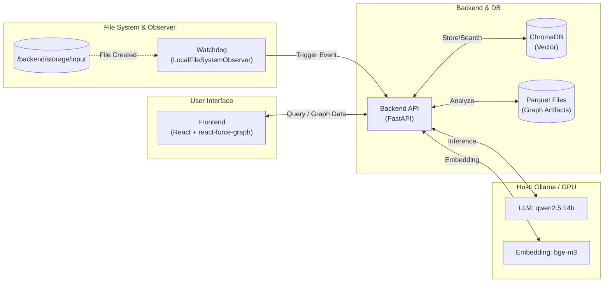

# Local RAG Comparator (GraphRAG vs Vector RAG)

完全ローカル環境（Mac Apple Silicon）で動作する、「通常のVector RAG」と「Microsoft GraphRAG」の比較・検証プラットフォームです。
外部API（OpenAIなど）に一切依存せず、プライバシーを保ったまま高度なRAGの精度比較を行うことができます。

## 🌟 特徴 (Features)

- **完全ローカル稼働**: Ollamaを利用し、GPU（Metal）を活用したローカルLLMで推論とグラフ生成を実行。
- **ハイブリッド・コンテナ設計**: AIのパフォーマンスを最大化するため「OllamaはMacネイティブ起動（GPU直結）」しつつ、「API・DB・フロントエンドはDockerコンテナ化」するモダンな構成を採用。
- **GraphRAG vs Vector RAG**: ChromaDBによるチャンク検索と、Microsoft `graphrag` によるナレッジグラフ検索を並行実行し、UI上で回答を比較可能。
- **DDD & クリーンアーキテクチャ**: 複雑なAI技術（ChromaDB, GraphRAG CLI, PyMuPDF等）をインフラストラクチャ層に隠蔽し、ビジネスロジックを独立させた保守性の高い設計。
- **TDD (テスト駆動開発)**: t-wada氏の提唱するRed-Green-Refactorサイクルを前提とし、ドメイン層・ユースケース層の堅牢なテストを完備。
- **インタラクティブなUI**: React (`react-force-graph`) を用いて、抽出されたナレッジグラフの繋がりを美しく可視化。
- **Swagger UI 完備**: FastAPIの自動生成機能により、`/docs` エンドポイントでAPI仕様書（OpenAPI）を即座に確認・テスト可能。FE/BEの並行開発を強力にサポート。

## 🏗️ アーキテクチャ

本プロジェクトは、MacのGPUリソースを最大限に活用しつつ、アプリケーションのポータビリティを維持するため、Native & Docker ハイブリッド構成を採用しています。



### コンポーネント詳細 (Component Details)

- **Host (Mac Native)**:
  - **Ollama**: 推論エンジン。GPU (Metal) に直接アクセスし、`qwen2.5:14b` と `bge-m3` を高速に実行。
- **Backend (Docker)**:
  - **FastAPI**: クリーンアーキテクチャに基づいたAPI実装。
  - **Event Watcher**: `watchdog` によりストレージへのファイル配置を検知し、非同期でパースを開始。
  - **GraphRAG CLI**: Microsoft公式エンジンをコンテナ内で実行し、ナレッジグラフを構築。
- **Frontend (Docker)**:
  - **React**: `react-force-graph` を使用し、GraphRAGが生成した複雑なエンティティ関係を3D/2Dで可視化。
- **Database (Docker)**:
  - **ChromaDB**: ベクトル検索エンジン。`bge-m3` で生成されたベクトルデータを永続化。
- **Graph Storage**: File-based (Apache Parquet)
  - Microsoft GraphRAGの標準仕様に準拠。インデックス作成時にLLMが抽出したエンティティ・関係性をParquet形式で永続化し、検索時に高速ロードして利用。

## 📋 動作要件 (Prerequisites)

- macOS (Apple Silicon M1/M2/M3/M4) ※推奨メモリ: 24GB以上
- [Homebrew](https://brew.sh/ja/)
- [Docker Desktop for Mac](https://www.docker.com/products/docker-desktop/)
- [Ollama](https://ollama.com/)（ホストへの事前インストールが必要）
- Python 3.11+（venv 用）
- Node.js 22（`.node-version` で指定。[mise](https://mise.jdx.dev/) での管理を推奨）
  ```bash
  # .node-version を mise で自動認識させる設定（初回のみ）
  mise settings add idiomatic_version_file_enable_tools node
  ```

## 🚀 クイックスタート (Getting Started)

開発者体験（DX）を最大化するため、環境構築から起動までを `Makefile` で完全に自動化しています。

### 1. セットアップ（初回のみ）

Ollama モデルのダウンロード（約10GB）・Python venv の作成・npm install・Docker イメージのビルドを一括で行います。

```bash
make setup
```

完了後、Python venv を有効化します（IDE の補完・ローカルテスト用）：

```bash
source backend/.venv/bin/activate
```

### 2. アプリケーションの起動

Ollama の起動確認後、Docker コンテナ群をバックグラウンドで立ち上げます。

```bash
make up
```

起動後、以下の URL にアクセスしてください：

| サービス | URL |
|---|---|
| Frontend (UI) | <http://localhost:5173> |
| Backend API Docs | <http://localhost:8000/docs> |
| ChromaDB | <http://localhost:8001> |

### 3. 終了

```bash
make down
```

## 🛠️ Makefile コマンド一覧

| コマンド | 説明 |
|---|---|
| `make setup` | 初回セットアップ（Ollama Pull + venv + npm install + Docker build） |
| `make up` | 全コンテナをバックグラウンド起動 |
| `make down` | 全コンテナを停止 |
| `make build` | Docker イメージのみビルド |
| `make test-backend` | バックエンドの pytest を実行 |
| `make logs` | 全サービスのログをストリーム表示 |

## 📂 ディレクトリ構成

```txt
/
 ├── .node-version        # Node.js バージョン管理（唯一の管理箇所）
 ├── .gitignore
 ├── Makefile             # 開発用コマンド集（setup / up / down / test-backend 等）
 ├── docker-compose.yml   # コンテナ構成（backend / frontend / vectordb）
 ├── backend/
 │    ├── Dockerfile
 │    ├── requirements.txt      # Docker 用の全依存パッケージ
 │    ├── requirements-dev.txt  # ローカル venv 用（pytest / fastapi 等）
 │    ├── src/
 │    │    ├── main.py
 │    │    ├── domain/          # エンティティ・インターフェース
 │    │    ├── application/     # ユースケース
 │    │    ├── infrastructure/  # ChromaDB, GraphRAG CLI などの実装
 │    │    ├── interfaces/      # FastAPI Router
 │    │    └── core/            # 設定・DI・プロンプト管理
 │    └── tests/
 │         ├── unit/            # ドメイン・アプリケーション層の高速テスト
 │         └── integration/     # インフラ・インターフェース層の結合テスト
 └── frontend/                  # React (Vite + TypeScript)
      ├── Dockerfile             # ARG NODE_VERSION で .node-version から受け取る
      └── src/
```

## 📝 参考文献 & クレジット

- [Microsoft GraphRAG](https://github.com/microsoft/graphrag)
- [Ollama](https://ollama.com/)
- [ChromaDB](https://www.trychroma.com/)

## 📄 ライセンス

This project is licensed under the MIT License.
